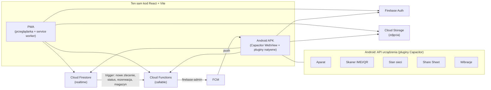

# FonExpert Serwis: aplikacja progresywna (PWA) i hybrydowa (Android)

Dokument dla projektu z przedmiotu o aplikacjach progresywnych i hybrydowych.
Opisuje, jak **jeden kod** panelu `gsm-admin-panel` działa jako **PWA** w przeglądarce i jako **aplikacja Android** (Capacitor).

| | |
|---|---|
| Nazwa aplikacji | **FonExpert Serwis** |
| Package / App ID | `pl.fonexpert.serwis` |
| Wersja | `1.0.0` (versionCode `10000`) |
| Repozytorium | https://github.com/frajewski/fonexpertserwis (folder `gsm-admin-panel/`) |
| Projekt Firebase | `gsmserviceapp-ff8f6` |

---

## A. Opis projektu

FonExpert Serwis to panel pracownika i administratora serwisu GSM. Obsługuje:

- przyjmowanie i prowadzenie zleceń napraw,
- skup i komis telefonów,
- magazyn części,
- klientów, rezerwacje i koszty.

Panel powstał jako aplikacja webowa (React + Firebase). W ramach projektu stał się:

1. **PWA**: instalowalną aplikacją webową z service workerem i manifestem.
2. **Aplikacją hybrydową Android**: ten sam kod webowy działa w natywnym kontenerze **Capacitor**. Dostęp do sprzętu daje przez natywne pluginy: aparat, skaner kodów, stan sieci, udostępnianie, powiadomienia push, wibracje, informacje o urządzeniu.

Najważniejsza zasada: **logika biznesowa i UI są wspólne**. Wersja natywna dokłada tylko warstwę „mostu” do API telefonu. W przeglądarce te funkcje mają webowy odpowiednik albo się ukrywają.

---

## B. Architektura

### Frontend
- **React 18** (JavaScript, JSX) + **React Router 6** (routing SPA) + **Zustand** (stan aplikacji).
- **Vite 5**: dev server i build produkcyjny (`dist/`).
- **PWA**: `vite-plugin-pwa` (Workbox, `generateSW`) generuje service worker i manifest.
- **Capacitor 8**: natywny projekt Android (`android/`) ładuje zbudowany `dist/` do WebView.

### Backend (Firebase, bez własnego serwera)
- **Firebase Auth**: logowanie e-mail + hasło. Role (`admin` / `worker`) są w custom claims tokenu.
- **Cloud Firestore**: baza danych z aktualizacjami na żywo (`onSnapshot`).
- **Cloud Storage**: zdjęcia urządzeń i umów.
- **Cloud Functions (v2, Node 22)**: operacje zaufane (role, rejestracja urządzeń push, wysyłka push, funkcje panelu klienta).
- **Firebase Cloud Messaging (FCM)**: powiadomienia push na Androida.



Wersja tekstowa:

```
PWA (przeglądarka)  ─┐
                     ├─► Firebase Auth ─► Firestore (realtime) ─► Storage ─► Cloud Functions ─► FCM ─► push na Androida
Android (Capacitor) ─┘                                            ▲
        │                                                         └── trigger Firestore (nowe zlecenie, status, …)
        └─► pluginy natywne: Camera, Barcode Scanner, Network, Share/Filesystem, Haptics, Device, App, StatusBar, SplashScreen
```

### Struktura kodu (najważniejsze katalogi)

| Ścieżka | Co zawiera |
|---|---|
| `src/pages/` | ekrany (zlecenia, skup, magazyn, konto…) – wspólne dla PWA i Androida |
| `src/native/` | warstwa natywna: haptics, status bar, splash, App Info / Device Info, przycisk Wstecz i lifecycle (`NativeShell.jsx`) |
| `src/network/` | stan sieci (Capacitor Network albo `navigator.onLine`) i baner offline |
| `src/push/` | rejestracja push, obsługa kliknięcia powiadomienia, powiadomienie w aplikacji |
| `src/scanner/` | skaner kodów i walidacja IMEI / QR |
| `src/documents/` | generowanie PDF i udostępnianie (Share Sheet / Web Share / pobranie) |
| `src/utils/platform.js` | wykrywanie platformy: `Capacitor.isNativePlatform()` |
| `android/` | natywny projekt Android (Gradle, manifest, ikony, splash) |
| `../firebase/` | reguły Firestore/Storage, indeksy, Cloud Functions |

---

## C. PWA

- **Manifest** (`vite.config.js` → `manifest.webmanifest`): nazwa „FonExpert – Panel serwisowy”, `display: standalone`, ikony 192/512 (także maskable).
- **Service worker**: generowany przez Workbox (`registerType: 'autoUpdate'`). Cache'uje powłokę aplikacji (HTML/JS/CSS/ikony), więc PWA uruchamia się bez sieci, a nowa wersja instaluje się sama przy następnym otwarciu.
- **Rejestracja SW** (`src/registerServiceWorker.js`) działa **tylko w przeglądarce**. W aplikacji Android jest pomijana, bo pliki i tak są lokalnie w APK.
- **Instalacja**: Chrome/Edge → „Zainstaluj aplikację”; Safari iOS → „Udostępnij → Do ekranu początkowego”.
- **Hosting**: Firebase Hosting (`gsm-admin-panel/firebase.json`, folder `dist`, przekierowanie SPA na `index.html`).

---

## D. Capacitor

- Wersja: **Capacitor 8.5.2** (`@capacitor/core`, `cli`, `android`, `ios`). Wszystkie pluginy są dla Capacitor 8.
- Konfiguracja: `capacitor.config.ts`:
  - `appId: pl.fonexpert.serwis`, `appName: FonExpert Serwis`, `webDir: dist`,
  - `server.androidScheme: 'https'`: aplikacja działa pod `https://localhost` (secure context; stały origin, więc sesja logowania i `localStorage` się nie gubią),
  - `SplashScreen`: chowany przez aplikację po sprawdzeniu sesji (limit bezpieczeństwa 3 s),
  - `StatusBar`: `overlaysWebView: true` (edge-to-edge); kolor ikon dobiera `src/native/statusBar.js`,
  - `PushNotifications.presentationOptions: []`: przy otwartej aplikacji pokazujemy własne powiadomienie w aplikacji.
- Mechanizm: `npm run build` → `dist/` → `npx cap sync android` kopiuje pliki do `android/app/src/main/assets/public` i rejestruje pluginy w Gradle.
- Kod sprawdza platformę przez `Capacitor.isNativePlatform()` i `Capacitor.isPluginAvailable()`. Funkcje natywne mają fallback webowy albo są ukryte w PWA.

---

## E. Android

| Parametr | Wartość |
|---|---|
| applicationId / namespace | `pl.fonexpert.serwis` |
| Nazwa (launcher) | `FonExpert Serwis` (`res/values/strings.xml`) |
| minSdk / targetSdk / compileSdk | 26 (Android 8.0) / 36 / 36 |
| versionName / versionCode | z `package.json` → `1.0.0` / `10000` (patrz *Wersjonowanie*) |
| Ikona | adaptive icon (gradient + „F”, warstwa monochrome dla ikon tematycznych), generator: `scripts/generate-android-assets.mjs` |
| Splash | Android 12+ SplashScreen API: granatowe tło `#11172B` + znak F |
| Ikona powiadomień | `res/drawable/ic_stat_fonexpert.xml` (biała, wektor) |
| Kanał powiadomień | `fonexpert_general` („FonExpert — powiadomienia”) |
| Backup danych | `allowBackup="false"` (sesja i dane nie trafiają do kopii zapasowej Google) |

### Uprawnienia (tylko wymagane)

| Uprawnienie | Skąd | Po co |
|---|---|---|
| `INTERNET` | manifest aplikacji | Firebase |
| `CAMERA` | manifest aplikacji (+ skaner) | zdjęcia i skanowanie kodów (runtime, pytanie przy pierwszym użyciu) |
| `POST_NOTIFICATIONS` | manifest aplikacji | push na Androidzie 13+ (pytanie dopiero po kliknięciu „Włącz powiadomienia”) |
| `ACCESS_NETWORK_STATE` | plugin Network | wykrywanie online/offline i typu sieci |
| `VIBRATE` | plugin Haptics | wibracje |
| uprawnienia FCM (`WAKE_LOCK`, odbiór C2DM) | Firebase Messaging | odbiór push |

Aplikacja **nie** prosi o dostęp do pamięci ani galerii. PDF do udostępnienia powstaje w katalogu cache aplikacji i trafia do innych aplikacji przez `FileProvider`.

### Zachowanie systemowe
- **Wstecz**: zamyka otwarte menu/modal → cofa w historii routera. Na ekranie głównym chowa aplikację w tło. Przy braku historii (start z powiadomienia) idzie do ekranu nadrzędnego.
- **Lifecycle**: po `resume` aplikacja odświeża stan sieci, zgodę na powiadomienia i kolor paska statusu. Nie przeładowuje strony, nie resetuje formularzy, nie wylogowuje.
- **Safe areas**: aplikacja rysuje się pod paskami systemowymi. Odstępy biorą się ze zmiennych `--safe-area-inset-*` wstrzykiwanych przez Capacitor.

---

## F. Firebase: co wykorzystuje aplikacja hybrydowa

| Usługa | Użycie w aplikacji |
|---|---|
| **Auth** | logowanie e-mail/hasło, reset hasła, zmiana hasła. W aplikacji natywnej `initializeAuth` + `indexedDBLocalPersistence` (stabilne w WebView) |
| **Firestore** | kolekcje `repairs`, `users`, `phones`, `parts`, `expenses`, `tasks`, `bookingRequests`, `meta/settings`, `counters`. Nasłuch na żywo (`onSnapshot`): zmiana na jednym urządzeniu jest od razu widoczna na drugim. Urządzenia push: `users/{uid}/devices/{deviceId}` (zapis tylko przez Cloud Function) |
| **Storage** | zdjęcia: `repairs/{id}/…`, `trade/{id}/…`. Zapis tylko personel, obrazy < 8 MB |
| **Cloud Functions** | `decideInitialRole`, `syncOwnRoleClaim`, `setUserRoleClaim` (role); `registerPushDevice`, `unregisterPushDevice`, `sendTestPush` (push); triggery `pushOnRepairCreated`, `pushOnRepairUpdated`, `pushOnBookingCreated`, `pushOnLowStock`, `pushOnTaskCreated`, `pushOnTaskAssigned`; funkcje panelu klienta (`lookupRepairByToken` i in.) |
| **FCM** | push na Androida. Token urządzenia zapisuje backend; wysyłka **tylko** z Cloud Functions (`firebase-admin`) |

### Bezpieczeństwo
- Brak sekretów w kodzie klienta. Konfiguracja Firebase w `firebaseConfig.js` jest publiczna z założenia, a dostęp chronią reguły i Auth.
- Brak kluczy Admin SDK / service account w repo. Działają tylko w Cloud Functions.
- Brak publicznego endpointu do wysyłania push: wszystkie funkcje to `onCall` z weryfikacją roli. `sendTestPush` jest tylko dla admina i tylko na jego własne urządzenia.
- Tokeny FCM nie są pokazywane w UI ani logowane.
- Reguły Firestore/Storage (`../firebase/*.rules`) opierają się na rolach z custom claims. Domyślnie wszystko, co nie jest wymienione, jest zablokowane.
- Logi produkcyjne pokazują tylko kod błędu (`src/utils/devLog.js`). Pełne obiekty błędów są widoczne wyłącznie w trybie developerskim.
- Hasła do keystore są poza repo (`android/keystore.properties` w `.gitignore`).

---

## G. Pluginy natywne

Wersje z `package.json`:

| Plugin | Wersja | Do czego |
|---|---|---|
| `@capacitor/core` / `cli` / `android` / `ios` | 8.5.2 | runtime i narzędzia Capacitor |
| `@capacitor/camera` | ^8.2.5 | zdjęcie urządzenia przy przyjęciu, zdjęcia w zleceniu i skupie |
| `@capacitor/barcode-scanner` | ^3.1.2 | skan IMEI (Code 128) i kodu QR z potwierdzenia przyjęcia |
| `@capacitor/network` | ^8.0.1 | online/offline, Wi-Fi/LTE, baner offline, blokada zapisu bez sieci |
| `@capacitor/share` | ^8.0.3 | Android Share Sheet (PDF, wiadomości do klienta) |
| `@capacitor/filesystem` | ^8.1.4 | zapis PDF do cache przed udostępnieniem |
| `@capacitor/push-notifications` | ^8.1.3 | FCM: rejestracja, odbiór, kliknięcie powiadomienia |
| `@capacitor/haptics` | ^8.0.2 | wibracje: sukces / ostrzeżenie / błąd / lekka |
| `@capacitor/device` | ^8.0.3 | model, system, WebView (ekran diagnostyczny) |
| `@capacitor/app` | ^8.1.2 | przycisk Wstecz, lifecycle (resume), App Info |
| `@capacitor/status-bar` | ^8.0.4 | kolor ikon paska statusu |
| `@capacitor/splash-screen` | ^8.0.2 | ekran startowy |

### Funkcje: PWA vs Hybrid Android

| Funkcja | PWA | Hybrid Android |
|---|---|---|
| Camera | ograniczona/web: `<input type="file" accept="image/*">` | natywna: `@capacitor/camera` (aparat systemowy, uprawnienia) |
| Network | web API: `navigator.onLine` + zdarzenia | Capacitor Network: online/offline + typ (Wi-Fi/LTE) |
| Share | Web Share API albo pobranie PDF | Android Share Sheet (Gmail, Drive, WhatsApp…) |
| Scanner | fallback/manual: ręczne wpisanie IMEI | natywny skaner (ML Kit): IMEI + QR zlecenia |
| Push | opcjonalny web (nie włączony w tym projekcie) | FCM: foreground (w aplikacji), tło, zamknięta aplikacja |
| Haptics | brak (no-op) | natywne wibracje |
| Status bar / splash / Wstecz | przeglądarka | natywne, dopasowane do ekranu |
| Device / App Info | dane przeglądarki + wersja builda | model, Android, WebView, versionCode |

---

## H. Build

### Development (przeglądarka)
```bash
cd gsm-admin-panel
npm install
npm run dev          # http://localhost:5174
```

### Build web + Android
```bash
npm run build              # PWA → dist/
npx cap sync android       # kopiuje dist + aktualizuje pluginy/config w android/
npx cap open android       # Android Studio → ▶ Run (debug)
```

Po zmianach tylko w kodzie web:
```bash
npm run build
npx cap copy android
```
Po zmianie `capacitor.config.ts` albo pluginów: `npx cap sync android`.

### Push (FCM): jednorazowa konfiguracja
1. Firebase Console → projekt `gsmserviceapp-ff8f6` → *Dodaj aplikację Android* → package `pl.fonexpert.serwis` → pobierz `google-services.json`.
2. Zapisz go jako `android/app/google-services.json`.
3. `npm run build && npx cap sync android`. Build sprawdza obecność pliku; bez niego push jest wyłączony, a aplikacja nie crashuje.
4. Backend: `cd ../firebase && firebase deploy --only firestore:rules,firestore:indexes,functions`.

### Release APK / AAB
1. **Keystore** (raz, trzymaj **poza repo** i zrób kopię; bez niego nie wydasz aktualizacji):
   ```bash
   mkdir -p ~/keys
   "/Applications/Android Studio.app/Contents/jbr/Contents/Home/bin/keytool" -genkeypair -v \
     -keystore ~/keys/fonexpert-release.jks -alias fonexpert \
     -keyalg RSA -keysize 2048 -validity 10000
   ```
2. `cp android/keystore.properties.example android/keystore.properties` i uzupełnij ścieżkę (bezwzględną) i hasła. Plik jest w `.gitignore`. Zamiast pliku można użyć zmiennych `FX_KEYSTORE_FILE`, `FX_KEYSTORE_PASSWORD`, `FX_KEY_ALIAS`, `FX_KEY_PASSWORD`.
3. Build:
   ```bash
   npm run build && npx cap sync android
   cd android
   export JAVA_HOME="/Applications/Android Studio.app/Contents/jbr/Contents/Home"
   ./gradlew assembleRelease bundleRelease
   ```
   - APK: `android/app/build/outputs/apk/release/app-release.apk`
   - AAB (Google Play): `android/app/build/outputs/bundle/release/app-release.aab`

   Alternatywa bez pliku properties: Android Studio → *Build → Generate Signed App Bundle / APK*.
4. Instalacja na telefonie: **najpierw odinstaluj wersję debug** (inny podpis), potem `adb install android/app/build/outputs/apk/release/app-release.apk` albo skopiuj APK na telefon.

### Wersjonowanie
- Jedno źródło prawdy: pole `version` w `gsm-admin-panel/package.json`.
- `versionName` = ta wersja; `versionCode` = `major·10000 + minor·100 + patch` (1.0.0 → 10000, 1.0.1 → 10001, 1.1.0 → 10100, 2.0.0 → 20000). Każda wyższa wersja daje wyższy kod, czego Android wymaga przy aktualizacji.
- Zasady: poprawka błędu → `patch` (1.0.1); nowa funkcja → `minor` (1.1.0); duża zmiana → `major` (2.0.0).
- Wydanie: `npm version patch --no-git-tag-version` → `npm run build` → `npx cap sync android` → release build.
- Wersja i build są widoczne w aplikacji: *Moje konto → Informacje o aplikacji*.

---

## I. Testy

### Automatyczne (przeglądarka, podstawione pluginy Capacitor i Firebase)
Scenariusze sprawdzone w Chromium z symulacją platformy Android:
- **Splash i status bar**: splash chowany raz po sprawdzeniu sesji; kolor ikon w pionie, poziomie, z modalem i na ekranie logowania.
- **Przycisk Wstecz**: modal → zamknięcie; zlecenie → lista; menu → zamknięcie; głęboka nawigacja; zimny start z powiadomienia; ekran główny → aplikacja w tło.
- **Lifecycle**: formularz po pause/resume i po powrocie z aparatu; brak reloadu i wylogowania; odświeżenie sieci i zgody na push.
- **Haptics**: sukces zapisu, ostrzeżenie (offline, zły kod), błąd zapisu, zmiana statusu; brak pluginu = no-op; **PWA: zero wywołań natywnych**.
- **Skaner**: zły IMEI, poprawny IMEI, QR → otwarcie zlecenia.
- **Błędy**: `FirebaseError` → „Brak uprawnień do tej operacji.”
- **Logowanie**: poprawne / złe hasło (czytelny komunikat), wylogowanie (odpięcie push), rola pracownika (brak sekcji admina).
- **Diagnostyka**: wersja, build, model, system; brak nazwy urządzenia i tokenu FCM.
- **UI**: 360 px, 1280 px, klawiatura (pole i „Zapisz” osiągalne), poziom (brak poziomego scrolla, modal i menu w bezpiecznym obszarze).

### Ręczne na telefonie: checklista regresji
| # | Obszar | Scenariusze |
|---|---|---|
| 1 | Login | login, logout, złe hasło, konto admin i pracownik |
| 2 | Firestore | lista zleceń, nowe zlecenie, edycja, zmiana widoczna na żywo na 2. urządzeniu / w PWA |
| 3 | Camera | zdjęcie, anulowanie, odmowa uprawnienia (komunikat), upload do zlecenia |
| 4 | Network | online, tryb samolotowy (baner, blokada zapisu), Wi-Fi → LTE, LTE → Wi-Fi |
| 5 | Share | PDF potwierdzenia → Gmail, → Dysk, anulowanie arkusza |
| 6 | Scanner | IMEI z pudełka / `*#06#`, QR z potwierdzenia, zły kod, anulowanie |
| 7 | Push | aplikacja otwarta (powiadomienie w aplikacji), w tle, zamknięta, kliknięcie → zlecenie |
| 8 | Haptics | wibracja po zapisie, po złym skanie; w PWA brak |
| 9 | Lifecycle | wyjście do innej aplikacji i powrót, aparat w trakcie formularza |
| 10 | PWA | działa w Chrome, instalacja, upload zdjęcia, routing / odświeżenie podstrony |

---

## J. Znane ograniczenia

- **Offline**: powłoka aplikacji startuje bez sieci (APK: pliki lokalne; PWA: service worker). Dane z Firestore są trzymane tylko w pamięci sesji, bez trwałej bazy offline. Zapisy i upload bez sieci są blokowane z czytelnym komunikatem, nie kolejkowane.
- **Push**: tylko Android (FCM). Web push i iOS push są celowo poza zakresem. Push wymaga `google-services.json` w `android/app/`.
- **Drukowanie**: w aplikacji natywnej zastąpione udostępnianiem PDF (WebView nie obsługuje `window.print()`).
- **Proces ubity w tle podczas robienia zdjęcia** (mało RAM): formularz nie jest odtwarzany (brak obsługi `appRestoredResult`).
- **Wstecz z wypełnionego formularza** cofa bez pytania o niezapisane dane.
- **iOS**: projekt `ios/` istnieje, ale etap końcowy dotyczy Androida; dopracowanie iOS jest poza zakresem.
- **Rozmiar bundla**: główny plik JS ma ok. 930 KB (245 KB gzip), głównie Firebase SDK. Biblioteki PDF i skanera są ładowane dopiero przy użyciu.

---

## PWA vs Hybrid

| Aspekt | PWA | Hybryda (Capacitor) |
|---|---|---|
| **Instalacja** | z przeglądarki („Zainstaluj aplikację”), bez sklepu, kilka sekund | plik APK / AAB (Google Play albo instalacja ręczna), ikona i splash natywne |
| **Dostęp do API urządzenia** | tylko to, co daje przeglądarka (Web APIs): część jest ograniczona albo niedostępna (np. natywny skaner, pełny push na każdym systemie, wibracje na iOS) | pełne API Androida przez pluginy: aparat systemowy, skaner ML Kit, FCM, Share Sheet, haptics, status bar, przycisk Wstecz |
| **Silnik** | przeglądarka użytkownika (Chrome, Safari…) | **Android System WebView** wewnątrz natywnej aktywności; JS ↔ natywny kod przez most Capacitor |
| **Service worker** | kluczowy: cache powłoki, offline, aktualizacje | niepotrzebny (pliki są w APK), dlatego w aplikacji jest wyłączony |
| **Aktualizacje** | automatyczne: nowy build na hostingu, SW pobiera go w tle | nowa wersja APK/AAB (wyższy versionCode) przez sklep albo ręczną instalację |
| **Offline** | powłoka z cache SW; dane zależne od strategii | powłoka zawsze lokalnie; dane jak w PWA (Firestore w pamięci) |
| **Dystrybucja** | link / URL, wyszukiwarki, brak weryfikacji sklepu | Google Play (podpis, przegląd, polityki) albo APK bezpośrednio |
| **Kod** | jeden kod React | **ten sam** kod React + cienka warstwa natywna |

---

## Scenariusz demonstracji (5–7 min)

| Czas | Krok | Co powiedzieć |
|---|---|---|
| 0:00 | **PWA** w Chrome na laptopie: logowanie, lista zleceń. Pokaż ikonę „Zainstaluj” / zainstalowane PWA | „To aplikacja webowa z manifestem i service workerem.” |
| 0:45 | **Ta sama aplikacja jako APK** na telefonie: ikona F, splash, login | „Ten sam kod React, opakowany w Capacitor.” |
| 1:30 | Otwórz **zlecenie**. Zmień status w PWA i pokaż, że telefon odświeża się sam | „Firestore realtime: wspólny backend.” |
| 2:00 | **Nowe zlecenie → Zrób zdjęcie** (natywny aparat) | „Plugin Camera, uprawnienie runtime.” |
| 2:45 | **Skanuj IMEI** (pudełko albo `*#06#` na drugim telefonie) → wibracja sukcesu | „Natywny skaner ML Kit + Haptics.” |
| 3:30 | Włącz **tryb samolotowy** → baner offline, próba zapisu zablokowana. *Moje konto → Połączenie* | „Capacitor Network: stan i typ sieci.” Wyłącz tryb samolotowy |
| 4:15 | W zleceniu **Udostępnij PDF** → Share Sheet (Gmail/Dysk) | „PDF generowany lokalnie, Filesystem + Share.” |
| 5:00 | *Moje konto* → **Wyślij testowe powiadomienie** → wyjdź do ekranu głównego | „Wysyłka tylko z Cloud Function, FCM.” |
| 5:30 | **Kliknij powiadomienie** (z nowego zlecenia albo testowe) → aplikacja otwiera ekran; **Wstecz** wraca | „Routing z payloadu, tylko dozwolone ekrany.” |
| 6:15 | *Moje konto → Informacje o aplikacji*: wersja, model, Android, WebView | Podsumowanie: co natywne, co webowe |

**Tip:** do pokazania kliknięcia w powiadomienie zleceń utwórz nowe zlecenie w PWA na laptopie. Admin dostaje wtedy push „Nowe zlecenie #…” na telefonie.

---

## Pytania prowadzącego: krótkie odpowiedzi

**Dlaczego to aplikacja hybrydowa?**
Interfejs i logika to aplikacja webowa (React), uruchamiana w natywnym kontenerze Android (WebView). Do funkcji telefonu (aparat, skaner, push, wibracje, Share Sheet) korzysta z natywnego kodu przez pluginy Capacitor. Jest instalowana jako APK, a nie otwierana z przeglądarki.

**Dlaczego Capacitor?**
Pozwala zachować istniejący kod React/Vite bez przepisywania i dokłada natywny projekt Android, który można otworzyć w Android Studio. Ma oficjalne, utrzymywane pluginy do potrzebnych API. Ta sama aplikacja dalej działa jako PWA. W porównaniu z Cordovą to nowocześniejszy most i projekt natywny traktowany jako kod źródłowy.

**Czym różni się PWA od hybrydy?**
PWA działa w przeglądarce i ma tylko Web API; instaluje się z linku i aktualizuje sama przez service worker. Hybryda to natywna aplikacja z WebView: pełny dostęp do API telefonu przez pluginy, dystrybucja jako APK/AAB, aktualizacja nową wersją. Tutaj obie wersje mają wspólny kod.

**Czy aplikacja działa offline?**
Częściowo. Aplikacja startuje bez sieci (pliki w APK / cache service workera) i wykrywa brak połączenia (baner, blokada zapisu z komunikatem). Dane z Firestore wymagają sieci; wczytane wcześniej zostają w pamięci do końca sesji. Pełnej synchronizacji offline świadomie nie wdrażaliśmy.

**Jak komunikujesz się z backendem?**
Bezpośrednio przez Firebase SDK: Auth (logowanie), Firestore (odczyt/zapis i nasłuch na żywo), Storage (zdjęcia). Operacje wymagające zaufania (role, rejestracja urządzenia push, wysyłka push) idą przez Cloud Functions typu `onCall`, które sprawdzają token i rolę. Bezpieczeństwo zapewniają reguły Firestore/Storage.

**Jak działa push notification?**
Po zgodzie użytkownika plugin rejestruje telefon w FCM i dostaje token. Aplikacja przekazuje go do Cloud Function, która zapisuje go przy koncie. Gdy w Firestore pojawi się np. nowe zlecenie, trigger Cloud Function wysyła push przez `firebase-admin` do urządzeń odpowiednich osób. Kliknięcie otwiera właściwy ekran na podstawie typu i ID z payloadu.

**Jak działa Firebase Auth?**
Użytkownik loguje się e-mailem i hasłem, a Firebase zwraca token JWT z rolą (custom claim `admin`/`worker`) nadaną przez Cloud Function. Token jest dołączany do zapytań do Firestore/Storage/Functions, a reguły bezpieczeństwa sprawdzają rolę. W aplikacji natywnej sesja jest trzymana w IndexedDB WebView, więc nie trzeba logować się przy każdym starcie.

**Dlaczego nie React Native?**
React Native wymagałby przepisania całego UI na komponenty natywne i utrzymywania drugiej wersji obok webowej. Capacitor pozwolił użyć istniejącego panelu 1:1 i jednocześnie zachować PWA. Dla aplikacji biznesowej z formularzami i listami wydajność WebView jest w pełni wystarczająca.

**Co jest natywne?**
Kontener aplikacji (Activity, WebView), ikona i splash, aparat, skaner kodów (ML Kit), powiadomienia FCM z kanałem i ikoną, Share Sheet, wibracje, stan sieci, pasek statusu, przycisk Wstecz i cykl życia aplikacji. Wszystko to przez pluginy Capacitor.

**Co pozostaje webowe?**
Cały interfejs (React), routing, logika biznesowa, generowanie PDF (jsPDF/html2canvas) i komunikacja z Firebase przez JS SDK. Ten sam kod działa w przeglądarce jako PWA.

---

## Technologie

- **JavaScript (ES2022)** + JSX; TypeScript tylko w `capacitor.config.ts`
- **React 18**, React Router 6, Zustand
- **Vite 5**, `vite-plugin-pwa` (Workbox)
- **PWA**: manifest, service worker
- **Capacitor 8** + 11 oficjalnych pluginów
- **Android**: Gradle, SDK 36, min. Android 8.0, AndroidX SplashScreen
- **Firebase**: Auth, Firestore, Storage, Cloud Functions (Node 22, v2), Cloud Messaging, Hosting
- jsPDF + html2canvas (PDF), ML Kit (skaner, przez plugin)

---

## Checklista przed prezentacją

- [ ] Telefon naładowany, ładowarka / powerbank pod ręką
- [ ] Zainstalowany **aktualny APK** (*Moje konto → Informacje o aplikacji* → wersja)
- [ ] Login działa (znasz hasło do konta admina; opcjonalnie konto pracownika)
- [ ] Internet działa na telefonie i laptopie (Wi-Fi sali albo hotspot)
- [ ] Firebase działa: lista zleceń się wczytuje
- [ ] `google-services.json` w buildzie; *Push zarejestrowany: Tak*; **testowy push przychodzi**
- [ ] Zgoda na aparat i powiadomienia udzielona wcześniej (bez niespodzianek na scenie)
- [ ] Aparat działa, skaner działa (przygotowane pudełko z IMEI albo drugi telefon z `*#06#`, wydrukowany QR z potwierdzenia)
- [ ] Istnieje przykładowe zlecenie (z klientem, ceną, zdjęciem) do pokazania i PDF
- [ ] PDF generuje się i otwiera Share Sheet
- [ ] PWA otwarte w Chrome na laptopie i zalogowane
- [ ] Tryb „Nie przeszkadzać” wyłączony (żeby push był widoczny), głośność wibracji włączona

## Plan awaryjny

**Internet padł na zajęciach:**
- pokaż, że aplikacja startuje (pliki lokalne w APK) i **wykrywa brak sieci** (baner, *Moje konto → Połączenie*, blokada zapisu z komunikatem),
- **Camera**: zrób zdjęcie w formularzu nowego zlecenia (podgląd działa offline),
- **Scanner**: zeskanuj IMEI i pokaż walidację, wibracje sukces/ostrzeżenie,
- **Haptics**: *Moje konto → Test wibracji*,
- **Share lokalnie**: udostępnij PDF otwartego wcześniej zlecenia do aplikacji na telefonie (np. Pliki/Bluetooth),
- **Informacje o aplikacji**: wersja, model, system.

**Push nie przyszedł:**
- nie blokuj prezentacji: pokaż *Moje konto → Powiadomienia push* (zgoda, „zarejestrowane: Tak”),
- pokaż kod wysyłki (`firebase/functions/push.js`) i Firebase Console (Functions → logi, Firestore → `users/{uid}/devices`),
- opowiedz flow z sekcji „Jak działa push notification?” i przejdź dalej.
